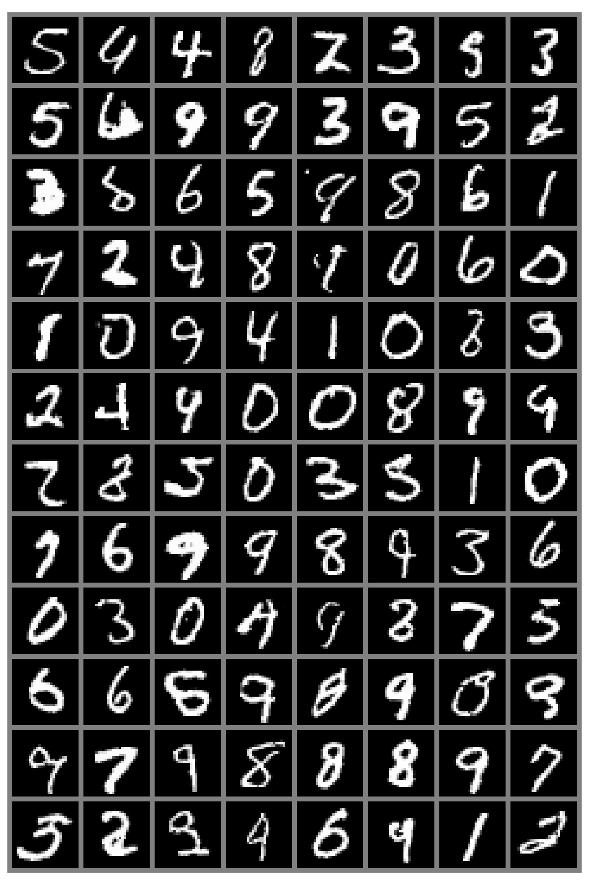
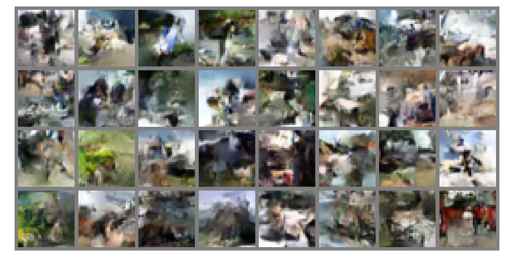

# Normalizing flows Image Generation on MNIST and CIFAR10

### Project Overview

This project is a deep learning-based image generation model that supports training and testing with MNIST and CIFAR10 datasets. By running the corresponding training and testing scripts, you can train the model and generate images.

Due to computation resource limitations, we only use a small dataset of LSUN to show it can be adapted to the dataset.


### File Structure

#### 1. Python Training Files

- `train_mnist.py` - Training script for the MNIST dataset
- `train_cifar.py` - Training script for the CIFAR dataset
- `train_LSUN.py` - Training script for the LSUN dataset

#### 2. Testing Files

- `test_mnist.py` - Testing script for the trained MNIST model
- `test_cifar.py` - Testing script for the trained CIFAR model
- `test_lsun.py` - Testing script for the trained LSUN model

### 3. Core File

- `net_work.py` - The main file defining the network architecture 

#### 4. Main Directories

- `dataset/` - Stores datasets
- `saved_model_ckpt/` - Stores model checkpoints
- `result_visualization/` - Stores generated image results


### Usage Instructions

#### 1. Train the Model

Run the following commands to train the model on the respective dataset:

```shell
python train_mnist.py  # Train the MNIST model
python train_cifar.py  # Train the CIFAR model
```

#### 2. Test the Model

After training, run the following commands to test the model's generated results:

```shell
python test_mnist.py  # Test MNIST generated results
python test_cifar.py  # Test CIFAR generated results
```


### Result Visualization

After testing, the generated images will be saved in the `result_visualization/` directory for review and analysis.


### Dependencies

Ensure that your environment has the following dependencies installed:

- Python 3.9+
- PyTorch
- NumPy
- Matplotlib
- PyTorch Lightning
- TQDM


### Results

| Image generation on MNIST                            | Image generation on CIFAR10                         |
| ---------------------------------------------------- | --------------------------------------------------- |
|  |  |
|                                                      |                                                     |